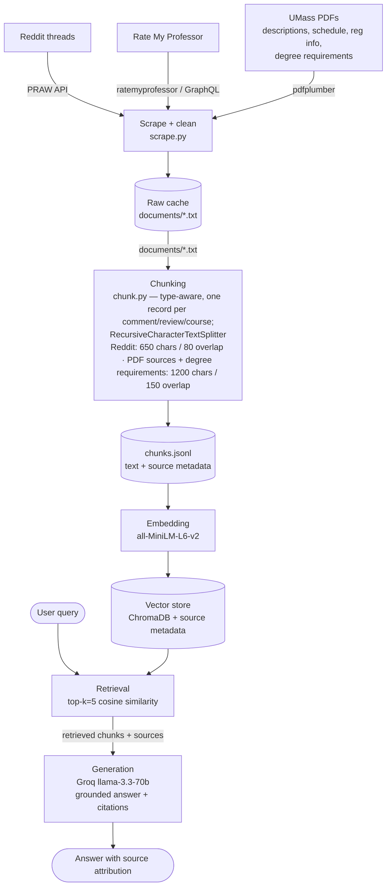

# Project 1 Planning: The Unofficial Guide

> Write this document before you write any pipeline code.
> Your spec and architecture diagram are what you'll use to direct AI tools (Claude, Copilot, etc.) to generate your implementation — the more specific they are, the more useful the generated code will be.
> Update the Retrieval Approach and Chunking Strategy sections if you change your approach during implementation.
> Update this file before starting any stretch features.

---

## Domain

<!-- What domain did you choose? Why is this knowledge valuable and hard to find through official channels? -->
My domain is Computer Science course selections: what classes to choose for electives and from the 300s to 400s, and even to 500s - graduate student's electives.
As a freshman, I find that asking advisors about which electives to take isn't effecient and useful, since they haven't taken the course yet. There are studnet Peer Advisors, but sometimes you just want a broader view of the general opinion of electives in the recent years. Extracting and combining information directly from Course Descriptions, Reddit and Rate My Professor, we can deploy a RAG system that receives well-rounded, grounded information.
---

## Documents

<!-- List your specific sources: URLs, subreddit names, forum threads, or file descriptions.
     Aim for at least 10 sources that together cover different subtopics or perspectives within your domain. -->

| # | Source | Description | URL or location |
|---|--------|-------------|-----------------|
| 1 | Reddit| Easy 200+ CS Courses |https://www.reddit.com/r/umass/comments/1ot0yto/easy_200_cs_courses/ |
| 2 | Reddit| Course recommendations MS CS |https://www.reddit.com/r/umass/comments/1da5coi/course_recommendations_ms_cs/ |
| 3 | Reddit| Thoughts on certain grad level CS classes |https://www.reddit.com/r/umass/comments/1aojcc8/thoughts_on_certain_grad_level_cs_classes/ |
| 4 | Reddit| Fall 24 CS Grad Course |https://www.reddit.com/r/umass/comments/1bymlyw/fall_24_cs_grad_course/ |
| 5 | Reddit| Easy CS electives |https://www.reddit.com/r/umass/comments/sdcne1/easy_cs_electives/ |
| 6 | Reddit| Easiest cs 400+/500+ courses.... |https://www.reddit.com/r/umass/comments/qubmte/easiest_cs_400500_courses/ |
| 7 | Reddit| CS courseload advice, 300s and 400s|https://www.reddit.com/r/umass/comments/patv3a/cs_courseload_advice/ |
| 8 | Reddit| Freshman CS Major, Second Semester Classes? |https://www.reddit.com/r/umass/comments/jdppi6/freshman_cs_major_second_semester_classes/|
| 9 | Rate My Professor | James Perretta | https://www.ratemyprofessors.com/professor/3114707 |
| 10 | Rate My Professor | Ella Tuson | https://www.ratemyprofessors.com/professor/3127793 |
| 11 | Rate My Professor | Marc Liberatore
 | https://www.ratemyprofessors.com/professor/1948400 |
| 12 | Rate My Professor | Phuthipong Bovornkeeratiroj
 | https://www.ratemyprofessors.com/professor/2992114 |
| 13 | Rate My Professor | Ghazaleh Parvini | https://www.ratemyprofessors.com/professor/2624866 |
| 14 | Rate My Professor | Justin Domke
 | https://www.ratemyprofessors.com/professor/2290260 |
| 15 | Rate My Professor | Marius Minea
 | https://www.ratemyprofessors.com/professor/2416008
| 16 | Rate My Professor | Cole Reilly | https://www.ratemyprofessors.com/professor/2912301 |
| 17 | Rate My Professor | Joe Chiu | https://www.ratemyprofessors.com/professor/2420066 |
| 18 | Rate My Professor | Mordecai Golin | https://www.ratemyprofessors.com/professor/2940693 |
| 19 | Local Repo | Spring 2026 Course Description | documents/s26_course_description.pdf |
| 20 | Local Repo | Spring 2026 Course Schedule | documents/s26_course_schedule.pdf |
| 21 | Local Repo | Spring 2026 Eligibility/Prereq. Registration Info | documents/s26_reg_info.pdf |
| 22 | Local Repo | Fall 2026 Course Description | documents/f26_course_description.pdf |
| 23 | Local Repo | Fall 2026 Course Schedule |  | documents/f26_course_schedule.pdf |
| 24 | Local Repo | Fall 2026 Eligibility/Prereq. Registration Info | documents/f26_reg_info.pdf |
| 25 | Local Repo | BS in Computer Science Degree Requirements: 2023 Revision | documents/computer_science_bs_requirement_f23.txt |
---

## Chunking Strategy

<!-- How will you split documents into chunks?
     State your chunk size (in tokens or characters), overlap size, and explain why those
     numbers fit the structure of your documents.
     A review-heavy corpus warrants different chunking than a long FAQ. -->

I will use recursive chunking to chunk up the documents. Each reddit and RMP comments, and course descriptions are self contained within itself. The program should chunk the comments into chunks with some overlap, however there shouldn't be overlaps between seperate comments and reivews. Course schedule and registration information also have a well-defined structure for each course, so we chunk each row of the tables within these documents into a chunk to maintain the integrity of the information. Course descriptions and Degree Requirement have varying information density - some go into more depth than others - so we should break the descriptions down into smaller chunks with some overlaps in between.

For Rate My Professor chunks, some are smaller since the original reviews themselves can be shorter. For example, "He's the goat", "Best Instructor ever", "Goated professor", etc. I have decided to keep these smaller chunks without further changes, since they are original and still carry meanings. Further prompting with Github Copilot suggests that the shorter chunks may make the retrieval process a little bit trickier due to these smaller chunks may be seen as noise, bad quality data and embeddings that have less semantic signal. Though, the LLM does suggest that I should still keep this approach for the shorter chunks and tune the retrieval instead.

### For Reddit threads

**Chunk size:** up to 650 characters, or up to the end of each post/comment

**Overlap size:** 80 characters.

**Reasoning:** Based on the mean and median size of reddit comments and posts used in the corpus.

### For Course Descriptions & Degree Requirements

**Chunk size:** up to 1200 characters, or up to the end of each review/comment/description/row

**Overlap size:** 150 characters.

**Reasoning:** Claude Code has determined the size of each chunk should be 1200 characaters max with 150 characters overlap with calculations of mean and median size of each course description.

The BS in Computer Science Degree Requirement document is dense prose split into named sections (Overview, intro/core/math/elective course lists, lab science, residency, etc.) with varying depth. It uses the same recursive chunking approach and the same 1200 / 150 parameters as Course Descriptions: the recursive splitter prefers paragraph/section breaks (`\n\n`) so a whole section stays together when it fits, and the 150-character overlap keeps requirement clauses from being severed across a chunk boundary.

---

## Retrieval Approach

<!-- Which embedding model are you using (e.g., all-MiniLM-L6-v2 via sentence-transformers)?
     How many chunks will you retrieve per query (top-k)?
     If you were deploying this for real users and cost wasn't a constraint, what tradeoffs
     would you weigh in choosing a different embedding model — context length, multilingual
     support, accuracy on domain-specific text, latency? -->

For each query, ground the responses to the 5 most relevant chunks. Each chunk has the source information, source file type (Reddit Thread, Rate My Professor, Official Course information from UMass). Along with confidence metric using distance, and chunk's message.

**Embedding model:** all-MiniLM-L6-v2

**Top-k:** Use 5 most relevant chunks per query

**Production tradeoff reflection:**

---

## Evaluation Plan

<!-- List your 5 test questions with their expected correct answers.
     Questions should be specific enough that you can judge whether the system's response
     is right or wrong. "What are good dining halls?" is too vague.
     "What do students say about wait times at [dining hall name] during lunch?" is testable. -->

| # | Question | Expected answer |
|---|----------|-----------------|
| 1 | Which main 200-level courses are required for the CS major? | CICS 210, COMPSCI 220, COMPSCI 230, COMPSCI 240, COMPSCI 250 |
| 2 | What are some electives I can take for the MS CS? | CS 560, CS 576, CS 589, CS 651, CS 670, CS 690k, 651, CS 514, CS 611 |
| 3 | What are the most common reviews about Professor Parvini?| She's funny, she cares about students and will help students to understand concepts. She is disorganized though |
| 4 | I want to take CS 220, CS 230 and CS250 at the same time, give me their schedule times for lectures and labs in Fall 2026 | |
| 5 | What are the prerequisite classes for most 300-level courses?| CICS 210, CS 240, CS 220, CS 230, CS 250, CS 320|

---

## Anticipated Challenges

<!-- What could go wrong? Name at least two specific risks with reasoning.
     Consider: noisy or inconsistent documents, missing source attribution, off-topic
     retrieval, chunks that split key information across boundaries. -->

1. **Don't have a one-size-fits-all solution for chunking**: A chunking method can't fit three doc shapes (records vs. threads)

2. **Scraping the information online**

3. **Outdated professors' ratings**

---

## Architecture

<!-- Draw a diagram of your pipeline showing the five stages:
     Document Ingestion → Chunking → Embedding + Vector Store → Retrieval → Generation
     Label each stage with the tool or library you're using.
     You can use ASCII art, a Mermaid diagram, or embed a sketch as an image.
     You'll use this diagram as context when prompting AI tools to implement each stage. -->

---

## AI Tool Plan

<!-- For each part of the pipeline below, describe:
     - Which AI tool you plan to use (Claude, Copilot, ChatGPT, etc.)
     - What you'll give it as input (which sections of this planning.md, which requirements)
     - What you expect it to produce
     - How you'll verify the output matches your spec

     "I'll use AI to help me code" is not a plan.
     "I'll give Claude my Chunking Strategy section and ask it to implement chunk_text()
     with my specified chunk size and overlap" is a plan. -->

I'm going to use Claude Code. For each milestone, the API will read the entirety of planning.md, only implementing the functionality of the milestone while keep in mind the context of the project. 

**Milestone 3 — Ingestion and chunking:**
I'm going to ask Claude to code most of the data extraction process, since I don't have much knowledge about that. When the data is in pure JSON, or .txt files, I'm going to check the quality of the web scrape by seeing if users/profs' comments/reviews are there. I'm expecting the agent will produce a MVP with test data in the beginning, since the scraping pipeline might have to fall back in the first few iterations. For course registration info, I have deployed a specific scraping pipeline that ensures the pdf get scraped correctly through tables.

Each chunks will have metadata keys such as "professor", "course_code" and "rating" for RMP chunks; "semester", "course_code" for Course schedules and description. For most files, I will deploy recursive chunking to chunk each review/column/comment into one unique, non-overlapping chunk using the help of Claude Code and Cursor (with Claude Fable 5) for implementation. This is to ensure that each comments' content don't bleed into another comment's chunk. For Reddit threads and Course Descriptions, I decided to break down into multiple chunks per comment/description if they are too long, in order to save the context window for future LLM calls. Each chunk will also have "src_file" as a course 

**Milestone 4 — Embedding and retrieval:**
For embeddings, I'm going to use all-MiniLM-L6-v2 to embed natural language to vectors that are stored in ChromaDb.

For retrieval, I'm going to use the top 5 cosine simalrity scores, checking the distance in the retrieval process. I'm going to also print the retrived chunks to see its relevance and if it's information is enough to answer the question. 

Instead of pasting user's queries in the string format like in the Lab, I decided to stick with encoding our query to a vector embedding, and then pass it into ChromaDb for a proper cosine similarity search. Without this encoding step, the retrieved chunks will not align perfectly since the internal encoding model ChromaDb is using is different than all-MiniLM-L6-v2 with L2 normalization. In order to deploy consine similarity search, vectors need to be in the same emboding space. 
"If we then queried with query_texts, Chroma would embed the query with its own pipeline — possibly a different model build, different pooling, different normalization behavior. Two pipelines that are "both MiniLM" can still produce vectors that don't align perfectly, which silently degrades retrieval quality. No error, just worse rankings — the worst kind of bug to track down." - Claude Fable 5 via Cursor

**Milestone 5 — Generation and interface:**
I'm going to prompt engineer so that the LLM can ground the chunk's informations to answering the query without outside knowledge. I'm going to ask CoPilot for possible prompt exploits and injections.

I'm going to verify outputs with eval questions.